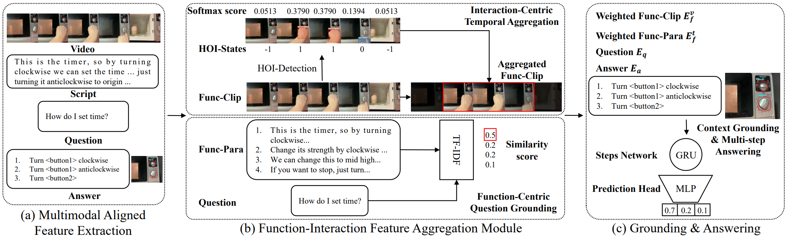
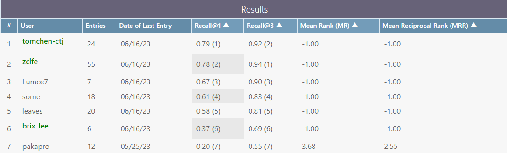

## First Place Solution to the CVPR'2023 AQTC Challenge 

### A Function-Interaction Centric Approach with Spatiotemporal Visual-Language Alignment

This repo provides the **1st place** solution(code and checkpoint) of the CVPR'23 LOVEU-AQTC challenge.

[[LOVEU@CVPR'23 Challenge]](https://sites.google.com/view/loveucvpr23/track3?authuser=0)  [[Technical Report]](https://arxiv.org/pdf/2306.13380.pdf)


Model Architecture ( Please refer to our [[Tech Report]](https://arxiv.org/pdf/2306.13380.pdf) for more details ;-) )




## Install

(1) PyTorch. See https://pytorch.org/ for instruction. For example,

```
conda install pytorch torchvision torchtext cudatoolkit=11.3 -c pytorch
```

(2) PyTorch Lightning. See https://www.pytorchlightning.ai/ for instruction. For example,

```
pip install pytorch-lightning
```

## Data

Download training set (without ground-truth labels) by filling in the [[AssistQ Downloading Agreement]](https://forms.gle/h9A8GxHksWJfPByf7).
Prepare the testing set via [[AssistQ test@23]](https://drive.google.com/file/d/1CiMJDG73TTrT7Ner7hUlz1LsSNa2LDmY/view).

## Encoding

Before starting, you should encode the instructional videos, scripts, function-paras, QAs. See [encoder/README.md](https://github.com/tomchen-ctj/CVPR23-LOVEU-AQTC/tree/main/encoder).

## Training & Evaluation

Select the config file and simply train, e.g.,

```
python train.py --cfg configs/model_egovlp_local.yaml
```

To inference a model, e.g.,

```
python inference.py --cfg configs/model_egovlp_local.yaml
```

The evaluation will be performed after each epoch. You can use Tensorboard, or just terminal outputs to record evaluation results.

```
CUDA_VISIBLE_DEVICES=0 python inference.py --cfg configs/model_egovlp_local.yaml CKPT "model_egovlp_local.ckpt"
```

## Results




| Model                                                        | Video Encoder | Image Encoder | Text Encoder | HOI  | R@1 | R@3 | CKPT  |
| ------------------------------------------------------------ | ------------- | ------------- | ------------ | ---- | -------- | -------- | ------ |
| Function-centric(baseline) ([configs/baseline.yaml](./configs/baseline.yaml)) | ViT-L         | ViT-L         | XL-Net       | N    | 63.9     | 89.5     |        |
| BLIP-Local ([configs/model_blip.yaml](configs/model_blip.yaml)) | BLIP-ViT      | BLIP-ViT      | BLIP-T       | N    | 67.5     | 88.2     | [link](https://drive.google.com/file/d/1xrIcKNnkHURNBejagQyuanBPHXOfr5H8/view?usp=sharing) |
| CLIP-Local ([configs/model_clip.yaml](configs/model_clip.yaml)) | CLIP-ViT      | CLIP-ViT      | XL-Net       | Y    | 67.9     | 88.9     | [link](https://drive.google.com/file/d/1mLbHyF5G1fl0MlEgo59xb2hJkwCU8X9Z/view?usp=sharing) |
| EgoVLP-Local  ([configs/model_egovlp_local.yaml](configs/model_egovlp_local.yaml)) | EgoVLP-V*     | EgoVLP-V*     | EgoVLP-T     | Y    | 74.1     | 90.2     | [link](https://drive.google.com/file/d/1csiwwqn6v6prVEiXIJezZVR9V5g8v7ta/view?usp=sharing) |
| EgoVLP-Global ([configs/model_egovlp_global.yaml](configs/model_egovlp_global.yaml)) | EgoVLP-V      | CLIP-ViT      | EgoVLP-T     | Y    | 74.8     | 91.5     | [link](https://drive.google.com/file/d/1u6BEg_pBccEM_ScsKIWvNbVDEJN3sxF3/view?usp=sharing) |
| Linear Ensemble                                              |               |               |              |      | 78.7     | 93.4     |        |

## Acknowledgement

Our code is based on [Function-Centric](https://github.com/starsholic/LOVEU-CVPR22-AQTC), [EgoVLP](https://github.com/showlab/EgoVLP) and [Afformer](https://github.com/showlab/afformer). We sincerely thank the authors for their solid work and code release.  Special thanks to [Ming](https://mitming.github.io/) for his valuable contributions and unwavering support throughout this competition.